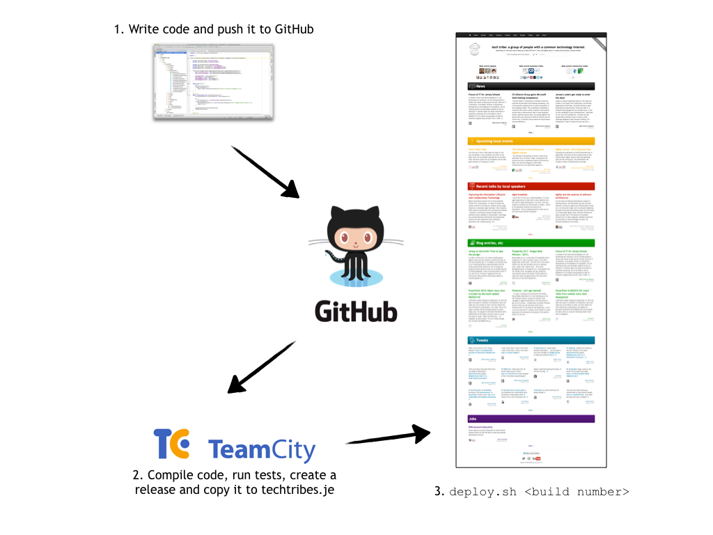

This section provides information about the mapping between the software architecture and the [infrastructure architecture](#InfrastructureArchitecture).

## Software

The live environment is a single Rackspace cloud server and therefore all of the following software is installed on the server via the Ubuntu Advanced Packaging Tool (apt).

- __Java 7 (Open JDK)__ (this needs to be patched with the [Java Cryptography Extension (JCE) Unlimited Strength Jurisdiction Policy Files](http://www.oracle.com/technetwork/java/javase/downloads/jce-7-download-432124.html) so that authentication via Twitter works)
- __Apache Tomcat 7__
- __MySQL 5.x__
- __MongoDB 2.2.x__

## Building techtribes.je

To avoid the "it works on my machine" syndrome, plus to ensure that builds are clean and repeatable, all releases are built by a continuous integration server - the free edition of TeamCity. The [build.xml script](https://github.com/techtribesje/techtribesje/blob/master/build.xml) does all of the heavy lifting of compiling, running the automated tests and creating a release package.

The final part of the build script, if the build is successful, is to securely copy the release up to the techtribes.je Rackspace server.

## Deploying techtribes.je

All of the techtribes.je software is installed underneath ~techtribesje/builds, with a subdirectory [per release](https://github.com/techtribesje/techtribesje/releases). There are a [number of scripts in GitHub](https://github.com/techtribesje/techtribesje-bin) that are used to unpack a release, switch version via symlinks and restart processes.

Deploying a new version, or rolling back to an old version, is as simple as running:

	~/bin/deploy.sh XYZ
	
(where XYZ is the number of the build created by the TeamCity continuous integration server)

## Configuration

The configuration files for the web server and content updater can be found at:

- /etc/techtribesje-web.properties
- /etc/techtribesje-updater.properties